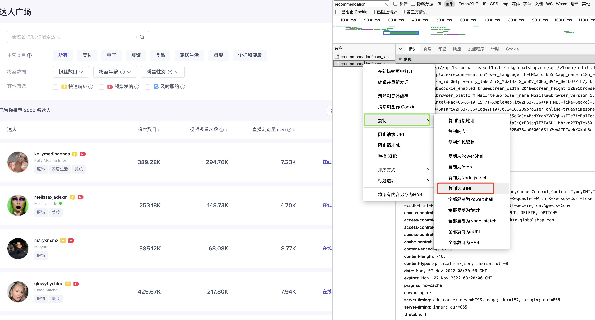

# TikTok Shop Tools

1. 爬取达人信息.
   1. 先手动在浏览器抓取一次网络请求.
        
   2. 将抓取的请求 右键复制为`curl`命令. 并保存到`curl.txt`文件中.
   3. 启动程序,开始爬取达人信息:

        ```bash
            ./tiktok-tools-darwin-amd64 crawl creators -f curl.txt -o out.csv
        ```
