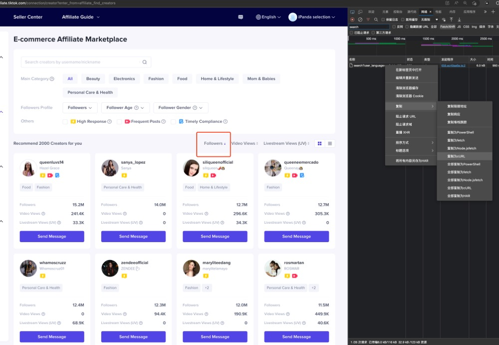

# TikTok Shop Tools

1. 从达人广场爬取达人信息.
   1. 先手动在浏览器抓取一次search网络请求(需要将页面排序方式切换为 按粉丝数倒序 排列).
        
   2. 将抓取的请求 右键复制为`curl(bash)`命令. 并保存到`curl.txt`文件中.
   3. 启动程序,通过在 终端中输入以下命令,开始爬取达人信息:

        ```bash
            ./tiktok-tools-darwin-amd64 crawl affiliate -f {CURL_FILE} -r {REGION_NAME} -d {每爬取1000条休息多久}
            #例如:
           ./tiktok-tools-darwin-amd64 crawl affiliate -f  ./curl.txt -r PH -d 30m
        ```

   4. 爬取过程会一直进行, 直到发生任何程序错误; 或者在命令行中按下 `ctrl + c` 停止爬取. 结果会保存在数据库中.
